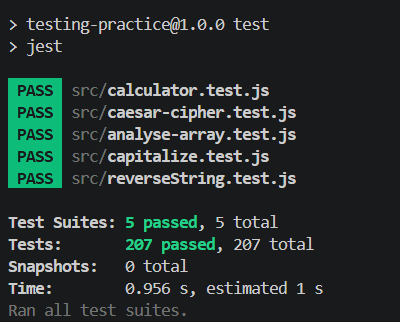

# Testing Practice

A suite of unit tests for several small utility functions :

- **capitalize** - capitalizes the first character of a string
- **reverse** - reverses a string
- **calculator** - performs basic arithmetic operations
- **caesarCipher** - applies a caesarCipher transformation to a given string
- **analyzeArray** - returns statistics for a numeric array

This is part of [The Odin Project's Full Stack JavaScript path](https://www.theodinproject.com/paths/full-stack-javascript) and provides hands-on practice writing unit tests using the Jest testing framework.

## Screenshot

## Installation

1. Clone the repository
2. Navigate to the project folder: `cd testing-practice`
3. Install dependencies: `npm install`
4. Run the test suite: `npm test`

## Features

- Comprehensive Jest unit tests
- Test-Driven Development (TDD)

## Technologies

- JavaScript
- Jest
